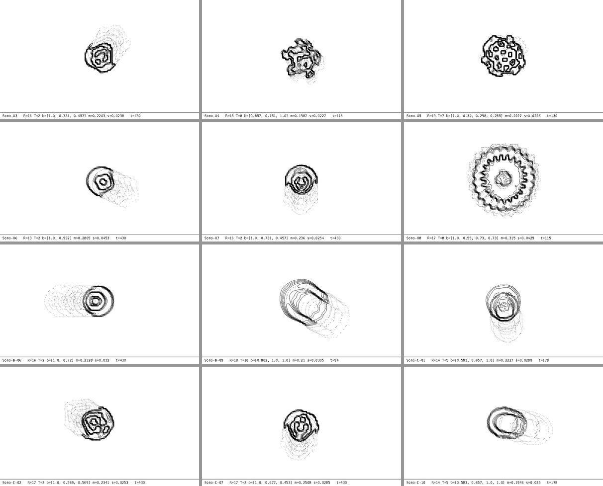

# lenia-trmnl

Lenia creatures on a TRMNL e-ink display, one frame per minute.



More: `docs/examples/` (overviews, portrait and ecosystem GIFs).

- `lenia_trmnl.py` simulates Lenia, searches for new species and renders TRMNL-format frames
  (`--device og` for 800x480 1-bit, `--device x` for 1872x1404 4-bit).
- A daily GitHub Action renders 24 h of frames to GitHub Pages.
- A Cloudflare Worker serves TRMNL's Redirect plugin: which frame now, and how long to sleep.

Working with Claude Code: open the repo and run `/setup` (first deployment), `/preview`, or `/new-species`.
Context for the agent lives in `CLAUDE.md`.

```
pip install -r requirements.txt
pytest -q && node --test worker/test/*.test.mjs
python lenia_trmnl.py render-day --n 20 --outdir site
```

Credits: Lenia by Bert Chan (https://github.com/Chakazul/Lenia). Orbium reference pattern from his work.

## License

MIT, see [LICENSE](LICENSE) — free to use, please keep the credit.
